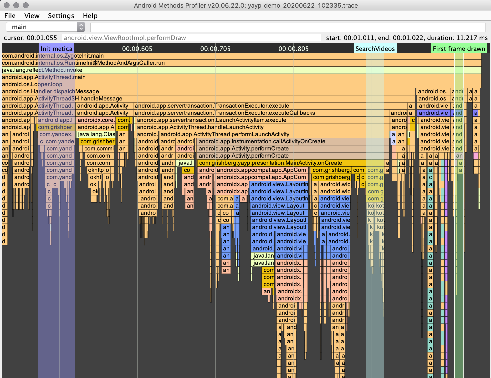

# Android Methods Profiler
This is tool for analyzing method trace files `.trace` files like [Android Profiler](https://developer.android.com/studio/profile/android-profiler) but works faster, has convenient control, user bookmarks and custom highlighting.




For Russian speaking developers there is a video [guide](https://www.youtube.com/watch?v=KgqYPXzLIqQ)

## Download
- [Download latest release](https://github.com/Grigory-Rylov/android-methods-profiler/releases)

## Hotkeys
### Files
**Ctrl + o** - Open file dialog

**Ctrl + n** - Record new method trace file

### Navigation
**w** - Zoom in

**s** - Zoom out

**a** - Pan left

**d** - Pan right

**Left, Right, Up, Down** (Mouse Drag) -  Pan the view 

**c** - Center screen on selected element

**f** - Fit zoom to current found element (or selected if there is no found elements).

**z** - Reset zoom to fit screen.

**q** - Go to previous found element

**e** - Go to next found element

**Ctrl + c** - Copy name of selected element

**Ctrl + '+' / '-'** - Increase / decrease font size

### Find / Bookmarks
**Ctrl + f** - Focus to the Find element field, to find elements press **Enter**

**Esc** - Exit from search mode. (Hide all found elements)

**m** - Add Bookmark from selected element

**Ctrl + m** - Add Bookmark from current found element

**m** - Add bookmark on selected element

**Shift + q** - Go to previous bookmark

**Shift + e** - Go to next bookmark

**Ctrl + r** - Remove current bookmark


### Reporting
**Ctrl + p** - Generate duration report

**Ctrl + s** - Generating selected method stacktrace into clipboard 

For mac uses use **Command** instead **Ctrl**

## Bookmarks
Helps to mark some methods in trace as importan event.
Bookmarks are saved automatically after you close the Trace Viewer.
Boormarks are stored in `$HOME/android-profile-viewer/markers` folder.
The easiest way to add bookmark is to click on the method and press **m** key.
In the opened dialog enter bookmark name and select color.


## New Trace Recording
1) Specify `$ANDROID_HOME` env variable
2) Start this app by `java -jar android-methods-profiler.jar`

After clicking on *New Trace* icon or pressing *Ctrl + n* record new trace dialog will be opened.
Saved `.trace` files wiil be placed in `$HOME/android-profile-viewer/trace` folder

In the opened dialog package field is reaqired, activity name is optional.
If you entered activity name then appliction will start after clicking `Start` button.
If activity field is empty - you need to start application manually, or it can already be running.

Sampling parameter: The lower the value, the more accurate the report will be, but the greater the load on the moblie phone CPU. For old device, like nexus 5X I prefer 1000 microseconds.
 


## Report generator
Generates flat list of methods with duration. Can be filtered by duration and/or is current method constructor.

## Highlighting: 
-  Choreographer.doFrame
-  measuring
-  layouting
-  inflating
-  drawing

Also you can add custom highlighting:
highlighting mapping placed in `$HOME/android-methods-profiler/colors.json`
for example:
```
[
  {
    "filter": "ru.yandex",
    "color": "FF9595"
  }
]
```
will highlight all methods of classes started with `ru.yandex`.

`colors.json` will be created automatically with sample highlighting

## Find class or methods
To find class or method you should press **Ctrl + f** or manually click to searching field.
Type class name and/or method name for example *SomeClass.someMethod* and press **Enter**. 

If current thead data contains any matches to the mask "\*.SomeClass.someMethod.\*" then these elements will be highlighted and the focus will be on the first element found.

If you want to find methods that ends with *SomeClass.someMethod* then type *SomeClass.someMethod()* and profiler will find any matches to the mask "\*.SomeClass.someMethod".

If there is no results in current thread, profiler will search it in another threads and ask you to switch to another thread if threre is any results - this can be very useful!

## Settings
Settings are stored in `$HOME/android-methods-profiler/.android-methods-profiler-settings.json`
