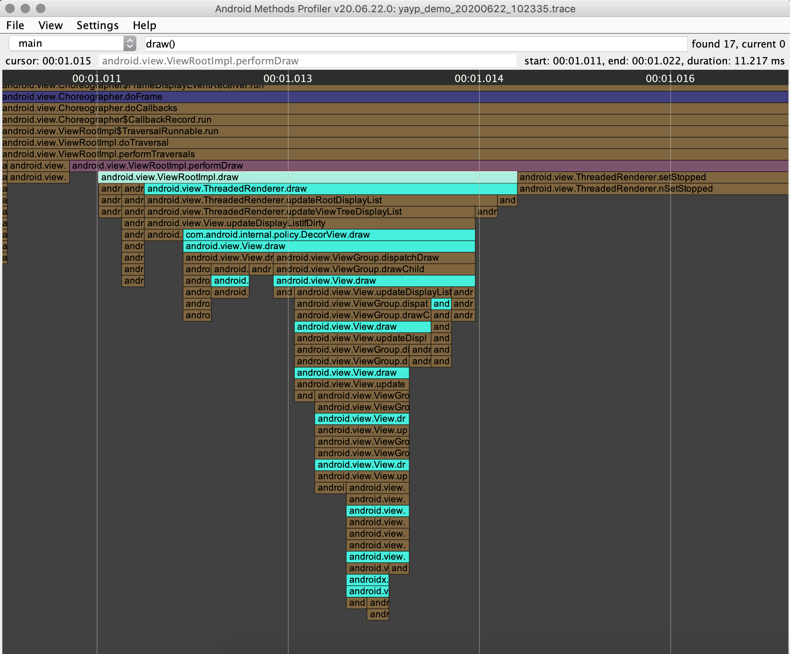

# Android Trace Viewer
Method Trace viewer for `.trace` files like [Android Profiler](https://developer.android.com/studio/profile/android-profiler) but works faster, has convenient control and  highlighting.

Also you can add custom bookmars and generate list of method-calls with showing bookmarks.

For now shows only thread-time




## Download
- [Download latest release](https://github.com/Grigory-Rylov/android-trace-viewer/releases)

## Hotkeys
### Files
**Ctrl + O** - Open file dialog

**Ctrl + N** - Record new method trace file

### Navigation
**W** - Zoom in

**S** - Zoom out

**A** - Pan left

**D** - Pan right

**Left, Right, Up, Down** (Mouse Drag) -  Pan the view 

**C** - Center screen on selected element

**F** - Fit zoom to current found element (or selected if there is no found elements).

**Z** - Reset zoom to fit screen.

**Q** - Go to previous found element (bookmark)

**E** - Go to next found element (bookmark)

**Ctrl + C** - Copy name of selected element

### Find / Bookmarks
**Ctrl + F** - Focus to the Find element field, to find elements press Enter.

**Ctrl + M** - Add Bookmarks instead all found elements.

**M** - Add bookmark on selected element

**Esc** - Exit from search mode. (Hide all found elements)

**Ctrl + R** - Remove current bookmark

### Reporting
**Ctrl + P** - Generate duration report

For mac uses use **Command** instead **Ctrl**

## Bookmarks
Helps to mark some methods in trace as importan event.
Bookmarks are saved automatically after you close the Trace Viewer.
Boormarks are stored in `$HOME/android-profile-viewer/markers` folder.
The easiest way to add bookmark is to click on the method and press **M** key.
In the opened dialog enter bookmark name and select color.


## New Trace Recording
After clicking on *New Trace* icon or pressing *Ctrl + N* record new trace dialog will be opened.
Saved `.trace` files wiil be placed in `$HOME/android-profile-viewer/trace` folder

In the opened dialog package field is reaqired, activity name is optional.
If you entered activity name then appliction will start after clicking `Start` button.
If activity field is empty - you need to start application manually, or it can already be running.

Sampling parameter: The lower the value, the more accurate the report will be, but the greater the load on the moblie phone CPU. For old device, like nexus 5X i prefer 1000 microseconds.
 


## Report generator
Generates flat list of methods with duration. Can be filtered by duration and/or is current method constructor.

## Highlighting: 
-  Choreographer.doFrame
-  measuring
-  layouting
-  inflating
-  drawing

Also you can add custom highlighting:
highlighting mapping placed in `$HOME/android-profile-viewer/colors.json`
for example:
```
[
  {
    "filter": "ru.yandex",
    "color": "FF9595"
  }
]
```
will highlight all methods of classes started with `ru.yandex`.

`colors.json` will be created automatically with sample highlighting
